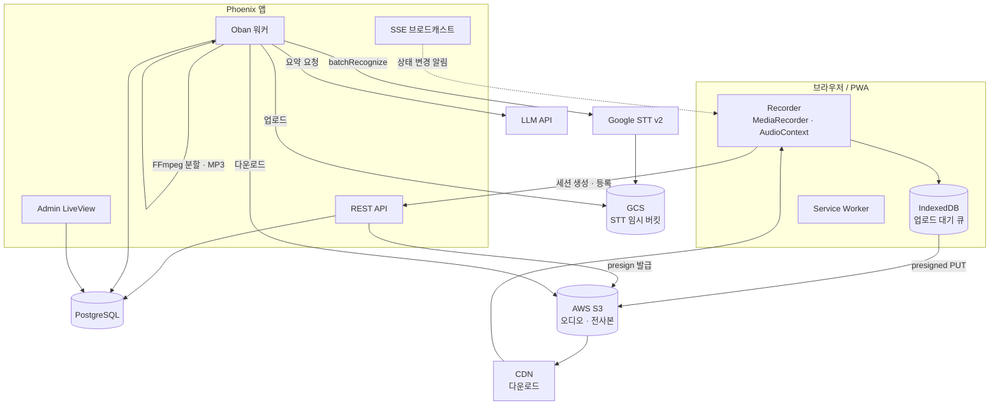

# 02. 아키텍처

## 스택

| 레이어 | 선택 | 비고 |
|---|---|---|
| 백엔드 | Phoenix (Elixir) | REST API + SSE |
| DB | PostgreSQL | Oban 큐도 같은 DB 사용 |
| 잡 큐 | Oban | 전사 · 분할 · 요약 · 크레딧 워커 |
| 암호화 | Cloak (AES-256-GCM) | DB에 저장되는 API 키 암호화 |
| 프론트 | React + TypeScript (Vite) | `packages/core` + `apps/web` |
| 어드민 | Phoenix LiveView | 별도 SPA 없음 |
| 스토리지 | AWS S3 (ExAws) | presigned PUT, CDN 도메인으로 다운로드 |
| STT | Google Cloud Speech-to-Text v2 (Chirp) | batchRecognize + GCS 임시 버킷 |
| LLM | Gemini 기본 / Anthropic / OpenAI 전환 가능 | 어댑터 패턴 |
| 미디어 | FFmpeg | 오디오 분할 · MP3 트랜스코딩 |

## 시스템 구성



## 리포 구조

```
voice-recording/
├─ docs/                     이 문서들
├─ backend/                  Phoenix 앱
│  ├─ lib/
│  │  ├─ vr/
│  │  │  ├─ accounts/        계정 · 세션 · 토큰
│  │  │  ├─ friends/         친구 · 초대
│  │  │  ├─ sharing/         공유 링크
│  │  │  ├─ access/          권한 계산 (Reviewer/Contributor/Viewer)
│  │  │  ├─ meetings/        회의 · 녹음 세션 · 화자
│  │  │  ├─ transcription/   Google STT · 오디오 분할
│  │  │  ├─ summarize/       LLM 어댑터 · 프롬프트 · 스키마
│  │  │  ├─ storage/         S3 presign (어댑터 인터페이스)
│  │  │  ├─ taxonomy/        토픽 · 라벨
│  │  │  ├─ billing/         플랜 · 구독 · 크레딧 원장
│  │  │  ├─ config/          설정 해석 (DB → ENV)
│  │  │  ├─ workers/         Oban 워커
│  │  │  └─ vault.ex         Cloak 암호화
│  │  └─ vr_web/
│  │     ├─ controllers/     REST API
│  │     ├─ live/admin/      어드민 LiveView
│  │     └─ plugs/           인증 · 권한
│  └─ priv/repo/migrations/
├─ packages/core/            프론트 비즈니스 로직 (UI 의존 0)
│  ├─ recorder/              녹음 엔진 · 파형 · 타이머
│  ├─ upload/                IndexedDB 큐 · presign · 재시도
│  ├─ api/                   타입 있는 API 클라이언트
│  ├─ domain/                transcript · speaker · summary · 권한 판정
│  └─ store/                 상태 관리
└─ apps/web/                 React UI (데스크톱 + 모바일 반응형)
   ├─ routes/
   ├─ components/
   └─ pwa/                   manifest · service worker
```

`packages/core`에는 React 의존성을 넣지 않는다. 나중에 UI를 한 벌 더 만들거나
다른 프레임워크로 교체해도 로직은 그대로 재사용된다.

## 화면을 어디서 그리는가

| 영역 | 기술 | 이유 |
|---|---|---|
| 로그인 · 가입 · 비밀번호 재설정 | Phoenix LiveView | 폼뿐이고 클라이언트 상태가 없다. 서버 렌더가 단순하고 빠르다 |
| 친구 · 계정 설정 | Phoenix LiveView | 위와 같다 |
| **회의 · 녹음 · 전사 · 요약** | **React SPA** (`/app`) | 타이머 · 파형 · 업로드 큐 등 클라이언트 상태가 무겁다 |
| 시스템 어드민 | Phoenix LiveView | 폼·테이블 위주. sisyphus 어드민 이식이 가장 쌈 |

React 앱은 Vite 가 `backend/priv/static/app` 으로 직접 빌드하고 Phoenix 가 서빙한다.
개발 서버를 따로 띄우지 않는다 — 서버가 둘이면 쿠키·CSRF·실기기 접속 주소가 어긋난다.

```bash
cd apps/web && npm run dev   # vite build --watch
```

## 배포 · 런타임 요구사항

| 항목 | 요구 |
|---|---|
| Elixir / Erlang | `.tool-versions`로 고정 |
| PostgreSQL | Oban 포함 |
| **FFmpeg** | `ffmpeg`, `ffprobe` 바이너리 필수 (오디오 분할 · 트랜스코딩) |
| 디스크 | 분할 작업 시 임시 파일 공간 (최대 원본 오디오 크기 × 2) |
| 아웃바운드 | S3, GCS, Google STT, LLM API |

Docker 이미지에 FFmpeg를 포함해야 한다. 없으면 20분 초과 녹음이 전사되지 않는다.

## 잡 큐 (Oban)

| 큐 | 동시성 | 워커 | 타임아웃 |
|---|---|---|---|
| `transcription` | 2 | `TranscriptionWorker` | 60분 |
| `transcription` | 2 | `AudioSplitWorker` | 30분 |
| `summarize` | 2 | `SummaryWorker` | 10분 |
| `billing` | 1 | `MonthlyGrantWorker`, `CreditExpiryWorker` | — |
| `maintenance` | 1 | `DeletionWorker` (예약 삭제) | — |

`SummaryWorker`는 `meeting_id` 단위로 unique를 걸어 중복 요약을 막는다.

## 실시간 (SSE)

클라이언트는 회의 상세 화면에서 SSE 스트림을 구독한다.

| 이벤트 | 발생 시점 |
|---|---|
| `session_status_changed` | 세션 상태 전이 (uploaded / splitting / transcribing / completed) |
| `session_transcription_failed` | 전사 실패 |
| `summary_completed` | 요약 완료 |
| `summary_failed` | 요약 실패 |

페이로드에 `changed_by_id`를 실어 자기 변경은 클라이언트에서 무시한다.
로컬 편집 직후에는 일정 시간 SSE 갱신을 무시해 편집 내용이 덮이는 것을 막는다.

## PWA

sisyphus의 서비스 워커는 정적 자산 캐시 + 푸시 알림만 했고 오프라인 녹음 대응은 없었다.
이 앱은 다음을 새로 설계한다.

| 항목 | 설계 |
|---|---|
| 설치 | `manifest.json`, `beforeinstallprompt` 캡처 |
| 정적 캐시 | 앱 셸 precache, `/api/`·`/sse/`는 캐시 제외 |
| 오프라인 녹음 | 녹음 자체는 완전히 클라이언트에서 동작. 업로드만 IndexedDB 큐에 적재 |
| 업로드 복구 | `online` 이벤트 + 앱 시작 시 재시도. Background Sync API 사용 검토 |
| 푸시 | 전사 완료 · 요약 완료 알림 (VAPID) |

**주의**: 녹음 중 화면 잠금/백그라운드 전환 시 모바일 브라우저가 `MediaRecorder`를 중단시킬 수 있다.
`beforeunload` 경고와 부분 저장으로 방어하고, 실제 기기에서 검증한다. → [11-roadmap.md](11-roadmap.md)
