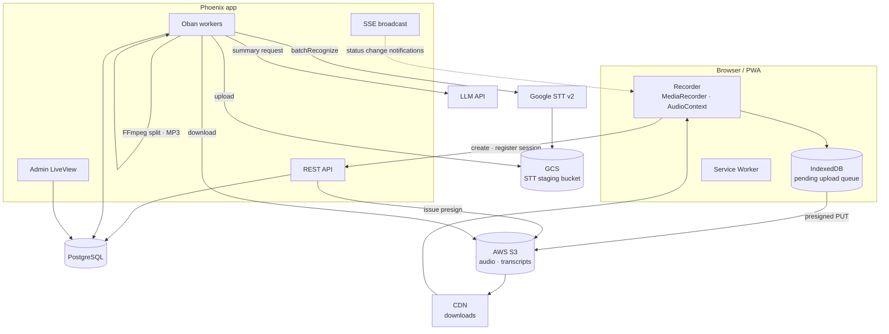

# 02. Architecture

## Stack

| Layer | Choice | Notes |
|---|---|---|
| Backend | Phoenix (Elixir) | REST API + SSE |
| DB | PostgreSQL | The Oban queue uses the same DB |
| Job queue | Oban | Transcription, splitting, summary, and credit workers |
| Encryption | Cloak (AES-256-GCM) | Encrypts API keys stored in the DB |
| Frontend | React + TypeScript (Vite) | `packages/core` + `apps/web` |
| Admin | Phoenix LiveView | No separate SPA |
| Storage | AWS S3 (ExAws) | Presigned PUT, downloads via CDN domain |
| STT | Google Cloud Speech-to-Text v2 (Chirp) | batchRecognize + GCS staging bucket |
| LLM | Gemini default / switchable to Anthropic / OpenAI | Adapter pattern |
| Media | FFmpeg | Audio splitting, MP3 transcoding |

## System layout



## Repo structure

```
voice-recording/
├─ docs/                     these documents
├─ backend/                  Phoenix app
│  ├─ lib/
│  │  ├─ vr/
│  │  │  ├─ accounts/        accounts · sessions · tokens
│  │  │  ├─ friends/         friends · invitations
│  │  │  ├─ sharing/         share links
│  │  │  ├─ access/          role resolution (Reviewer/Contributor/Viewer)
│  │  │  ├─ meetings/        meetings · recording sessions · speakers
│  │  │  ├─ transcription/   Google STT · audio splitting
│  │  │  ├─ summarize/       LLM adapters · prompts · schemas
│  │  │  ├─ storage/         S3 presign (adapter interface)
│  │  │  ├─ taxonomy/        topics · labels
│  │  │  ├─ billing/         plans · subscriptions · credit ledger
│  │  │  ├─ config/          config resolution (DB → ENV)
│  │  │  ├─ workers/         Oban workers
│  │  │  └─ vault.ex         Cloak encryption
│  │  └─ vr_web/
│  │     ├─ controllers/     REST API
│  │     ├─ live/admin/      admin LiveView
│  │     └─ plugs/           auth · authorization
│  └─ priv/repo/migrations/
├─ packages/core/            frontend business logic (zero UI dependencies)
│  ├─ recorder/              recording engine · waveform · timer
│  ├─ upload/                IndexedDB queue · presign · retries
│  ├─ api/                   typed API client
│  ├─ domain/                transcript · speaker · summary · role resolution
│  └─ store/                 state management
└─ apps/web/                 React UI (desktop + mobile responsive)
   ├─ routes/
   ├─ components/
   └─ pwa/                   manifest · service worker
```

`packages/core` has no React dependency. Even if we build another UI later or swap
frameworks, the logic is reused as-is.

## Where each screen is rendered

| Area | Technology | Why |
|---|---|---|
| Login, signup, password reset | Phoenix LiveView | Just forms with no client state. Server rendering is simple and fast |
| Friends, account settings | Phoenix LiveView | Same as above |
| **Meetings, recording, transcription, summary** | **React SPA** (`/app`) | Heavy client state: timers, waveforms, upload queue |
| System admin | Phoenix LiveView | Mostly forms and tables; porting the sisyphus admin is cheapest this way |

Vite builds the React app straight into `backend/priv/static/app`, and Phoenix serves it.
We do not run a separate dev server — with two servers, cookies, CSRF, and the address
used for real-device access all fall out of sync.

```bash
cd apps/web && npm run dev   # vite build --watch
```

## Deployment / runtime requirements

| Item | Requirement |
|---|---|
| Elixir / Erlang | Pinned via `.tool-versions` |
| PostgreSQL | Including Oban |
| **FFmpeg** | `ffmpeg` and `ffprobe` binaries required (audio splitting / transcoding) |
| Disk | Temporary file space for split jobs (up to 2× the original audio size) |
| Outbound | S3, GCS, Google STT, LLM APIs |

The Docker image must include FFmpeg. Without it, recordings over 20 minutes cannot be transcribed.

## Job queue (Oban)

| Queue | Concurrency | Worker | Timeout |
|---|---|---|---|
| `transcription` | 2 | `TranscriptionWorker` | 60 min |
| `transcription` | 2 | `AudioSplitWorker` | 30 min |
| `summarize` | 2 | `SummaryWorker` | 10 min |
| `billing` | 1 | `MonthlyGrantWorker`, `CreditExpiryWorker` | — |
| `maintenance` | 1 | `DeletionWorker` (scheduled deletions) | — |

`SummaryWorker` enforces uniqueness per `meeting_id` to prevent duplicate summaries.

## Real time (SSE)

The client subscribes to an SSE stream on the meeting detail screen.

| Event | When it fires |
|---|---|
| `session_status_changed` | Session state transition (uploaded / splitting / transcribing / completed) |
| `session_transcription_failed` | Transcription failed |
| `summary_completed` | Summary finished |
| `summary_failed` | Summary failed |

The payload carries `changed_by_id` so clients can ignore their own changes.
Right after a local edit, SSE updates are ignored for a short window so the edit
is not overwritten.

## PWA

The sisyphus service worker only did static asset caching and push notifications;
it had no offline-recording support. This app designs the following from scratch.

| Item | Design |
|---|---|
| Install | `manifest.json`, capture `beforeinstallprompt` |
| Static cache | Precache the app shell; exclude `/api/` and `/sse/` from caching |
| Offline recording | Recording itself runs fully client-side. Only uploads are queued in IndexedDB |
| Upload recovery | Retry on the `online` event and at app start. Evaluate the Background Sync API |
| Push | Transcription-complete and summary-complete notifications (VAPID) |

**Caution**: on screen lock or backgrounding during recording, mobile browsers may kill
`MediaRecorder`. Defend with a `beforeunload` warning and partial saves, and verify on
real devices. → [11-roadmap.md](11-roadmap.md)
