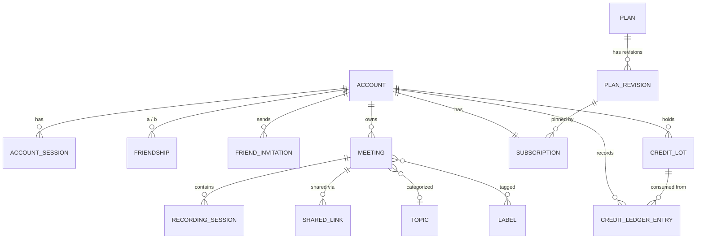

# 03. Domain Model

## Domain tree

```
Accounts
├─ Account          Account
├─ Session          AccountSession          multi-device login management
├─ Token            AccountToken            email confirmation · password reset
├─ Login attempt    LoginAttempt            brute-force defense
└─ Signup invite    InviteCode              (optional) signup restriction

Friends
├─ Friend invite    FriendInvitation        email or link · expiry · accept/decline
└─ Friendship       Friendship              one row per bidirectional pair

Meetings
├─ Meeting          Meeting
│   ├─ Recording    RecordingSession        one recording = one session
│   │   ├─ Transcript  transcript.segments[]   speaker · text · timestamps
│   │   └─ Speaker map speaker_map             speaker key → name · account
│   ├─ Summary      summary_data            LLM output (with source citations)
│   └─ Classification  topic_id, label_ids[]
└─ Taxonomy
    ├─ Topic        Topic
    └─ Label        Label

Sharing
├─ Share link       SharedLink              token · expiry · use count · PIN
└─ Access           Access                  Reviewer / Contributor / Viewer

Billing
├─ Plan             Plan → PlanRevision     immutable revision pinning
├─ Subscription     Subscription
├─ Credit lot       CreditLot               FIFO consumption unit
├─ Ledger           CreditLedgerEntry       append-only
├─ Pricing          ServicePricing, ModelPricing
└─ Audit log        BillingAuditLog

Admin
├─ System config    SystemConfig            encrypted key-value
├─ Auth provider    AuthProvider            social login ON/OFF + keys
├─ LLM provider     LlmProvider             per-brand keys · models · priority
└─ Commerce config  CommerceSettings        public-facing credit naming
```

## ID conventions

Follows the sisyphus style (prefix + random). No sequential integers are exposed.

| Entity | Prefix | Example |
|---|---|---|
| Account | `acct` | `acct_a1b2c3…` |
| AccountSession | `sess` | |
| FriendInvitation | `finv` | |
| Friendship | `frnd` | |
| Meeting | `meet` | |
| RecordingSession | `mrss` | |
| SharedLink | `slnk` | |
| GuestSession | `gses` | |
| Topic / Label | `topc` / `labl` | |
| Plan / PlanRevision | `plan` / `prev` | |
| Subscription | `subs` | |
| CreditLot | `clot` | |
| CreditLedgerEntry | `cled` | |

## ERD



---

## Accounts

### Account
```elixir
id                    :string   # acct_*
email                 :string   # unique
hashed_password       :string   # redact
name                  :string
confirmed_at          :utc_datetime
locale                :string   # en es zh_CN zh_TW ja ko
country               :string
time_zone             :string

# social login
is_social             :boolean, default: false
social_provider       :string   # google | github | ...
social_id             :string

is_admin              :boolean, default: false
onboarding_progress   :map, default: %{}

# account deletion
deleted_at            :utc_datetime
scheduled_deletion_at :utc_datetime
```
> No MFA-related fields. (Out of scope by decision)

### AccountSession
```elixir
id, account_id
session_token     :string   # unique
user_agent        :string
ip_address        :string
last_activity_at  :utc_datetime
expires_at        :utc_datetime
is_active         :boolean, default: true
```
Used for the device list display and remote logout.

### AccountToken
`account_id`, `token`, `context` (`confirm` | `reset_password` | `change_email`), `sent_to`, `expires_at`

### LoginAttempt
`email`, `ip_address`, `success`, `attempted_at` — used for per-account/per-IP lockout decisions.

---

## Friends

### FriendInvitation
```elixir
id                :string   # finv_*
invited_by_id     :string   # → Account
email             :string   # nil means a link-style invitation
token             :string   # unique
status            :string   # pending | accepted | declined | expired | cancelled
expires_at        :utc_datetime
accepted_by_id    :string   # the account that accepted
message           :string   # invitation message (optional)
```

### Friendship
```elixir
id                :string   # frnd_*
account_a_id      :string   # always the smaller ID
account_b_id      :string   # always the larger ID
status            :string   # active | blocked
blocked_by_id     :string   # if blocked, who blocked
became_at         :utc_datetime
```
Stored as **one row per sorted pair**. Duplicates prevented via `unique_index(:account_a_id, :account_b_id)`.
Lookups use `where a = me or b = me`.

---

## Meetings

### Meeting
```elixir
id                      :string   # meet_*
title                   :string
description             :string
status                  :string   # active | completed | archived
started_at              :utc_datetime

# people
owner_id                :string   # creator
reviewer_id             :string   # Reviewer (full control)
contributor_ids         {:array, :string}   # Contributors
permissions             :map      # %{"view" => %{"mode" => ..., "accountIds" => [...]}}
guest_link_enabled      :boolean, default: false

# classification
topic_id                :string
label_ids               {:array, :string}

# aggregate cache (summed from sessions)
total_duration_seconds  :integer, default: 0
total_credits_charged   :integer, default: 0

# summary
summary                 :string
decisions               {:array, :string}
summary_data            :map      # see 04-pipeline.md
last_summary_error      :map

archived_at             :utc_datetime
deleted_at              :utc_datetime
```

**State transitions**
```
active ──────► completed ──────► archived
   ▲               │
   └───────────────┘   (the Reviewer can revert)
```
- `active` — recording allowed
- `completed` — recording finished. Transcription/summary may still be in progress
- `archived` — archived. Hidden from lists by default, discoverable via filters

### RecordingSession
```elixir
id                :string   # mrss_*
meeting_id        :string
session_index     :integer, default: 1
status            :string   # recording | uploaded | splitting | transcribing | completed | failed
started_at_unix   :integer  # also used as the file name
duration_seconds  :integer
audio_url         :string
transcript_url    :string
transcript        :map      # %{"segments" => [...]}
speaker_map       :map      # %{"speaker_1" => %{"name" => ..., "account_id" => ...}}
credits_charged   :integer, default: 0
file_size_bytes   :integer
mime_type         :string
metadata          :map      # %{"language" => "ko-KR", "part" => %{...}}
error_message     :text
deleted_at        :utc_datetime
```

**State transitions**
```
recording ─► uploaded ─┬─► transcribing ─► completed
                       │                └─► failed
                       └─► splitting ──► (new sessions created per chunk, original deleted)
```

### Transcript segment structure
```jsonc
transcript = {
  "segments": [
    { "speaker": "speaker_1", "text": "Hello",
      "start_ms": 0, "end_ms": 1500, "confidence": 0.94 }
  ],
  "original_segments": [ /* pre-edit originals — for restore */ ]
}
```

### Speaker mapping
```jsonc
speaker_map = {
  "speaker_1": { "name": "Jane Doe", "account_id": "acct_xxx" },
  "speaker_2": { "name": "External attendee", "account_id": null }
}
```
- **Speaker chip change** → edits `speaker_map[key]` → applies to **all** utterances by that speaker
- **Segment change** → edits `segments[i].speaker` → applies to **that one line only**

---

## Taxonomy

### Topic
```elixir
id          :string   # topc_*
owner_id    :string   # owned by an account
name        :string
color       :string
sort_order  :integer
deleted_at  :utc_datetime
```

### Label
```elixir
id          :string   # labl_*
owner_id    :string
name        :string
color       :string
deleted_at  :utc_datetime
```

Topics are 1:N (one per meeting); labels are N:M (many per meeting).
They are the primary filters for archive search. → [08-frontend.md](08-frontend.md)

---

## Sharing

### SharedLink
```elixir
id              :string   # slnk_*
meeting_id      :string   # single FK. We removed sisyphus's polymorphic resource_type/resource_id reference
created_by_id   :string

# Only the **hash** of the token is stored. The plaintext leaves once, in the issuance response.
token_hash      :binary   # unique. sha256
token_prefix    :string   # first 12 chars. Identification in lists only — cannot grant entry by itself

granted_role    :string   # "viewer" | "contributor". **Immutable after issuance**
pin_hash        :string   # Bcrypt. nil = no PIN

max_uses        :integer  # nil = unlimited. 1 = one-time
use_count       :integer, default: 0
expires_at      :utc_datetime   # nil = never expires
is_active       :boolean, default: true
revoked_at      :utc_datetime

require_name    :boolean, default: true
require_email   :boolean, default: false

# PIN brute-force defense
failed_pin_attempts :integer, default: 0
pin_locked_until    :utc_datetime

last_used_at    :utc_datetime
metadata        :map
deleted_at      :utc_datetime
```

**Why a hash.** A share token is a credential that works immediately with no further
authentication. Anyone who sees it — in a DB backup, a replica, a dump — walks straight
into that meeting. We apply the same rule as `AccountSession`.

**Why Bcrypt for the PIN.** Six digits is 10^6, so a sha256 hash can be reversed in
seconds after a leak.

**Cloak cannot be used here.** The IV differs every time, making `WHERE token_hash = ?`
lookups impossible, and `CLOAK_KEY` lives next to the DB credentials, so they leak together.

**Why `granted_role` cannot be changed.** Upgrading a distributed `viewer` link to
`contributor` **retroactively escalates everyone** who received that link. We block it in
three layers: changeset, controller, and DB check. `"reviewer"` can never enter by any path.

### GuestSession — new (a concept sisyphus did not have)

```elixir
id              :string   # gses_*
shared_link_id  :string
meeting_id      :string   # **bound to exactly one meeting.** This value, not the request, determines the meeting
account_id      :string   # a logged-in account that lacks permission on this meeting

token_hash      :binary   # unique. sha256. Arrives via the X-Guest-Token header
granted_role    :string   # **copied and frozen** from the link (prevents post-hoc escalation)
display_name    :string
email           :string
user_agent      :string
ip_address      :string

last_activity_at :utc_datetime
expires_at       :utc_datetime  # min(now + 12h, link.expires_at)
revoked_at       :utc_datetime
```

sisyphus had no guest sessions — the guest API took the share token in the URL on every
request and re-checked it, and guest identity lived in a browser JS memory variable. The
server therefore never knew "which guests are inside right now", and revoking a link could
not disconnect anyone who was already in.

**Liveness checks re-read the link state every time.** If we only checked the session, a
Reviewer disabling the link or moving its expiry up would leave already-admitted guests
reading indefinitely.
The one exception is `max_uses` exhaustion — exhaustion means "no one else gets in", not
"kick out whoever is in".

### ShareAttempt

```elixir
id            :binary_id
token_hash    :binary
ip_address    :string
success       :boolean
attempted_at  :utc_datetime
```

For PIN brute-force defense. Per-link lockout alone (5 tries → 15 min) cannot stop an
attacker alternating between multiple links, so we also track per-IP (20 tries per 15 min).
We do not reuse `login_attempts` — that table's `email` column would lose its meaning.

---

## Billing

Schema details in [06-billing.md](06-billing.md). In brief:

| Schema | Role |
|---|---|
| `Plan` | Mutable metadata (name, description, visibility, status) |
| `PlanRevision` | **Immutable** commercial snapshot (price, included credits, limits) |
| `Subscription` | The contract an account holds. Pins a `PlanRevision` |
| `CreditLot` | A granted bundle of credits. Own balance and expiry |
| `CreditLedgerEntry` | Append-only record of changes |
| `ServicePricing` | External API unit cost → credit conversion (STT etc.) |
| `ModelPricing` | Per-LLM-model unit cost → credit conversion |
| `BillingAuditLog` | Audit of all commercial changes |

---

## Admin

| Schema | Role |
|---|---|
| `SystemConfig` | Encrypted key-value configuration |
| `AuthProvider` | Social login providers (ON/OFF + keys) |
| `LlmProvider` | LLM providers (keys, models, priority) |
| `CommerceSettings` | Public-facing credit naming, etc. |

Details in [07-config-admin.md](07-config-admin.md).
