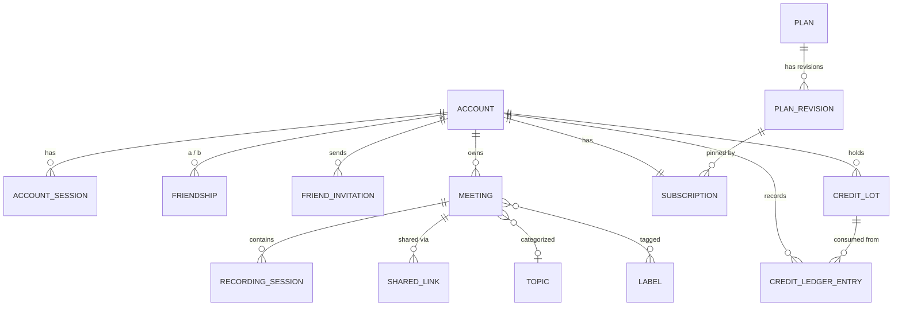

# 03. 도메인 모델

## 도메인 트리

```
계정 (Accounts)
├─ 계정            Account
├─ 세션            AccountSession          다기기 로그인 관리
├─ 토큰            AccountToken            이메일 확인 · 비밀번호 재설정
├─ 로그인 시도     LoginAttempt            무차별 대입 방어
└─ 가입 초대코드   InviteCode              (선택) 가입 제한

친구 (Friends)
├─ 친구 초대       FriendInvitation        이메일 또는 링크 · 만료 · 수락/거절
└─ 친구 관계       Friendship              양방향 1행

미팅 (Meetings)
├─ 회의            Meeting
│   ├─ 녹음        RecordingSession        녹음 1건 = 세션 1개
│   │   ├─ 전사    transcript.segments[]   화자 · 텍스트 · 시각
│   │   └─ 화자맵  speaker_map             화자키 → 이름 · 계정
│   ├─ 요약        summary_data            LLM 결과 (출처 인용 포함)
│   └─ 분류        topic_id, label_ids[]
└─ 분류 체계 (Taxonomy)
    ├─ 토픽        Topic
    └─ 라벨        Label

공유 (Sharing)
├─ 공유 링크       SharedLink              토큰 · 만료 · 사용횟수 · PIN
└─ 권한            Access                  Reviewer / Contributor / Viewer

구독·크레딧 (Billing)
├─ 플랜            Plan → PlanRevision     불변 리비전 핀 고정
├─ 구독            Subscription
├─ 크레딧 묶음     CreditLot               FIFO 소비 단위
├─ 원장            CreditLedgerEntry       append-only
├─ 가격표          ServicePricing, ModelPricing
└─ 감사 로그       BillingAuditLog

시스템 (Admin)
├─ 시스템 설정     SystemConfig            암호화 key-value
├─ 인증 제공자     AuthProvider            소셜 로그인 ON/OFF + 키
├─ LLM 제공자      LlmProvider             브랜드별 키 · 모델 · 우선순위
└─ 상거래 설정     CommerceSettings        크레딧 대외 명칭
```

## ID 규칙

sisyphus 방식(접두사 + 랜덤)을 따른다. 순차 정수 노출 없음.

| 엔티티 | 접두사 | 예 |
|---|---|---|
| Account | `acct` | `acct_a1b2c3…` |
| AccountSession | `sess` | |
| FriendInvitation | `finv` | |
| Friendship | `frnd` | |
| Meeting | `meet` | |
| RecordingSession | `mrss` | |
| SharedLink | `slnk` | |
| GuestSession | `gses` | |
| Topic / Label | `topc` / `labl` | |
| Plan / PlanRevision | `plan` / `prev` | |
| Subscription | `subs` | |
| CreditLot | `clot` | |
| CreditLedgerEntry | `cled` | |

## ERD



---

## Accounts

### Account
```elixir
id                    :string   # acct_*
email                 :string   # unique
hashed_password       :string   # redact
name                  :string
confirmed_at          :utc_datetime
locale                :string   # en es zh_CN zh_TW ja ko
country               :string
time_zone             :string

# 소셜 로그인
is_social             :boolean, default: false
social_provider       :string   # google | github | ...
social_id             :string

is_admin              :boolean, default: false
onboarding_progress   :map, default: %{}

# 탈퇴
deleted_at            :utc_datetime
scheduled_deletion_at :utc_datetime
```
> MFA 관련 필드는 두지 않는다. (D-비범위)

### AccountSession
```elixir
id, account_id
session_token     :string   # unique
user_agent        :string
ip_address        :string
last_activity_at  :utc_datetime
expires_at        :utc_datetime
is_active         :boolean, default: true
```
기기 목록 표시와 원격 로그아웃에 쓴다.

### AccountToken
`account_id`, `token`, `context`(`confirm` | `reset_password` | `change_email`), `sent_to`, `expires_at`

### LoginAttempt
`email`, `ip_address`, `success`, `attempted_at` — 계정/IP 단위 잠금 판단용.

---

## Friends

### FriendInvitation
```elixir
id                :string   # finv_*
invited_by_id     :string   # → Account
email             :string   # nil이면 링크형 초대
token             :string   # unique
status            :string   # pending | accepted | declined | expired | cancelled
expires_at        :utc_datetime
accepted_by_id    :string   # 수락한 계정
message           :string   # 초대 메시지 (선택)
```

### Friendship
```elixir
id                :string   # frnd_*
account_a_id      :string   # 항상 작은 쪽 ID
account_b_id      :string   # 항상 큰 쪽 ID
status            :string   # active | blocked
blocked_by_id     :string   # blocked인 경우 누가 차단했는지
became_at         :utc_datetime
```
**정렬쌍 1행** 저장. `unique_index(:account_a_id, :account_b_id)`로 중복 방지.
조회는 `where a = me or b = me`.

---

## Meetings

### Meeting
```elixir
id                      :string   # meet_*
title                   :string
description             :string
status                  :string   # active | completed | archived
started_at              :utc_datetime

# 사람
owner_id                :string   # 생성자
reviewer_id             :string   # Reviewer (전권)
contributor_ids         {:array, :string}   # Contributor
permissions             :map      # %{"view" => %{"mode" => ..., "accountIds" => [...]}}
guest_link_enabled      :boolean, default: false

# 분류
topic_id                :string
label_ids               {:array, :string}

# 집계 캐시 (세션에서 합산)
total_duration_seconds  :integer, default: 0
total_credits_charged   :integer, default: 0

# 요약
summary                 :string
decisions               {:array, :string}
summary_data            :map      # 04-pipeline.md 참조
last_summary_error      :map

archived_at             :utc_datetime
deleted_at              :utc_datetime
```

**상태 전이**
```
active ──────► completed ──────► archived
   ▲               │
   └───────────────┘   (Reviewer가 되돌릴 수 있음)
```
- `active` — 녹음 가능
- `completed` — 녹음 종료. 전사/요약은 계속될 수 있음
- `archived` — 보관됨. 목록에서 기본 숨김, 필터로 검색

### RecordingSession
```elixir
id                :string   # mrss_*
meeting_id        :string
session_index     :integer, default: 1
status            :string   # recording | uploaded | splitting | transcribing | completed | failed
started_at_unix   :integer  # 파일명으로도 사용
duration_seconds  :integer
audio_url         :string
transcript_url    :string
transcript        :map      # %{"segments" => [...]}
speaker_map       :map      # %{"speaker_1" => %{"name" => ..., "account_id" => ...}}
credits_charged   :integer, default: 0
file_size_bytes   :integer
mime_type         :string
metadata          :map      # %{"language" => "ko-KR", "part" => %{...}}
error_message     :text
deleted_at        :utc_datetime
```

**상태 전이**
```
recording ─► uploaded ─┬─► transcribing ─► completed
                       │                └─► failed
                       └─► splitting ──► (청크별 새 세션 생성, 원본 삭제)
```

### 전사 세그먼트 구조
```jsonc
transcript = {
  "segments": [
    { "speaker": "speaker_1", "text": "안녕하세요",
      "start_ms": 0, "end_ms": 1500, "confidence": 0.94 }
  ],
  "original_segments": [ /* 편집 전 원본 — 복원용 */ ]
}
```

### 화자 매핑
```jsonc
speaker_map = {
  "speaker_1": { "name": "홍길동", "account_id": "acct_xxx" },
  "speaker_2": { "name": "외부 참석자", "account_id": null }
}
```
- **화자 칩 변경** → `speaker_map[key]` 수정 → 그 화자의 **모든** 발언에 반영
- **세그먼트 변경** → `segments[i].speaker` 수정 → **그 한 줄만** 반영

---

## Taxonomy

### Topic
```elixir
id          :string   # topc_*
owner_id    :string   # 계정 소유
name        :string
color       :string
sort_order  :integer
deleted_at  :utc_datetime
```

### Label
```elixir
id          :string   # labl_*
owner_id    :string
name        :string
color       :string
deleted_at  :utc_datetime
```

토픽은 1:N(회의당 하나), 라벨은 N:M(회의당 여러 개).
아카이브 검색의 주 필터가 된다. → [08-frontend.md](08-frontend.md#아카이브-검색)

---

## Sharing

### SharedLink
```elixir
id              :string   # slnk_*
meeting_id      :string   # 단일 FK. sisyphus 의 resource_type/resource_id 다형 참조를 걷어냈다
created_by_id   :string

# 토큰은 **해시만** 저장한다. 원본은 발급 응답에서 한 번만 나간다.
token_hash      :binary   # unique. sha256
token_prefix    :string   # 앞 12자. 목록에서 식별만 한다 — 이것만으로는 못 들어온다

granted_role    :string   # "viewer" | "contributor". **발급 후 변경 불가**
pin_hash        :string   # Bcrypt. nil = PIN 없음

max_uses        :integer  # nil = 무제한. 1 = 1회성
use_count       :integer, default: 0
expires_at      :utc_datetime   # nil = 만료 없음
is_active       :boolean, default: true
revoked_at      :utc_datetime

require_name    :boolean, default: true
require_email   :boolean, default: false

# PIN 대입 방어
failed_pin_attempts :integer, default: 0
pin_locked_until    :utc_datetime

last_used_at    :utc_datetime
metadata        :map
deleted_at      :utc_datetime
```

**왜 해시인가.** 공유 토큰은 추가 인증 없이 즉시 통하는 자격증명이다. DB 백업 ·
리플리카 · 덤프 어디에서든 본 사람이 곧바로 그 회의에 들어온다. `AccountSession`
과 같은 규칙을 쓴다.

**왜 PIN 은 Bcrypt 인가.** 6자리는 10^6 이라 sha256 해시는 유출 시 몇 초 만에 역산된다.

**Cloak 은 쓸 수 없다.** IV 가 매번 달라 `WHERE token_hash = ?` 조회가 불가능하고,
`CLOAK_KEY` 는 DB 자격증명 옆에 살아 함께 유출된다.

**`granted_role` 을 바꿀 수 없는 이유.** 배포된 `viewer` 링크를 `contributor` 로
올리면 그 링크를 받은 **모든 사람의 권한이 소급 상승**한다. changeset · 컨트롤러 ·
DB check 세 겹으로 막는다. `"reviewer"` 는 어떤 경로로도 들어갈 수 없다.

### GuestSession — 신규 (sisyphus 에 없던 개념)

```elixir
id              :string   # gses_*
shared_link_id  :string
meeting_id      :string   # **회의 하나에만 묶인다.** 요청이 아니라 이 값이 회의를 정한다
account_id      :string   # 로그인은 했지만 그 회의 권한이 없는 경우

token_hash      :binary   # unique. sha256. 헤더 X-Guest-Token 으로 온다
granted_role    :string   # 링크에서 **복사해 굳힌다** (사후 승격 방지)
display_name    :string
email           :string
user_agent      :string
ip_address      :string

last_activity_at :utc_datetime
expires_at       :utc_datetime  # min(now + 12h, link.expires_at)
revoked_at       :utc_datetime
```

sisyphus 에는 게스트 세션이 없었다 — 게스트 API 가 매번 공유 토큰을 URL 로 받아
다시 조회했고, 게스트 신원은 브라우저 JS 메모리 변수였다. 그래서 서버가 "지금
들어와 있는 게스트"를 알지 못했고 링크를 폐기해도 이미 들어온 사람을 끊을 수 없었다.

**살아 있는지 판정할 때 링크 상태를 매번 다시 본다.** 세션만 보면 Reviewer 가
링크를 끄거나 만료를 당겨도 이미 들어온 사람이 계속 읽는다.
단 `max_uses` 소진은 예외다 — 소진은 "더 못 들어온다"이지 "들어온 사람을 내보낸다"가 아니다.

### ShareAttempt

```elixir
id            :binary_id
token_hash    :binary
ip_address    :string
success       :boolean
attempted_at  :utc_datetime
```

PIN 대입 방어용. 링크별 잠금(5회 → 15분)만 두면 공격자가 여러 링크를 번갈아
때리는 것을 못 막으므로 IP 별(15분 20회)도 함께 본다.
`login_attempts` 를 재사용하지 않는다 — 그 테이블의 `email` 컬럼 의미가 흐려진다.

---

## Billing

스키마 상세는 [06-billing.md](06-billing.md) 참조. 요약하면:

| 스키마 | 역할 |
|---|---|
| `Plan` | 가변 메타 (이름 · 설명 · 노출 여부 · 상태) |
| `PlanRevision` | **불변** 상업 스냅샷 (가격 · 포함 크레딧 · 한도) |
| `Subscription` | 계정이 가진 계약. `PlanRevision`을 핀 고정 |
| `CreditLot` | 지급된 크레딧 묶음. 자체 잔량 · 만료 |
| `CreditLedgerEntry` | append-only 증감 기록 |
| `ServicePricing` | 외부 API 단가 → 크레딧 환산 (STT 등) |
| `ModelPricing` | LLM 모델별 단가 → 크레딧 환산 |
| `BillingAuditLog` | 모든 상업 변경 감사 |

---

## Admin

| 스키마 | 역할 |
|---|---|
| `SystemConfig` | 암호화 key-value 설정 |
| `AuthProvider` | 소셜 로그인 제공자 (ON/OFF + 키) |
| `LlmProvider` | LLM 제공자 (키 · 모델 · 우선순위) |
| `CommerceSettings` | 크레딧 대외 명칭 등 |

상세는 [07-config-admin.md](07-config-admin.md).
