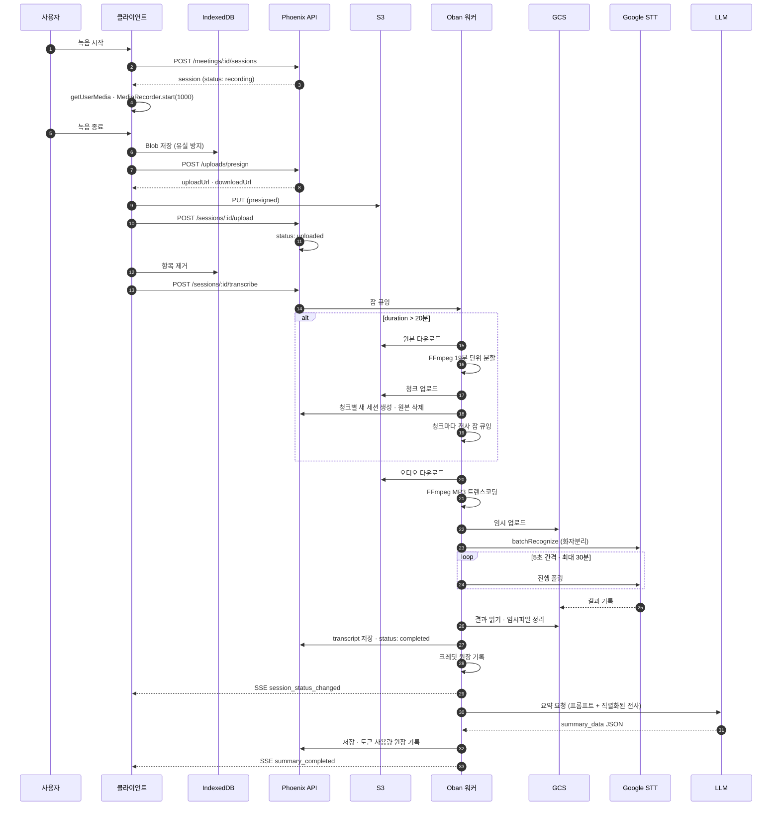

# 04. 녹음 파이프라인

녹음 한 번이 요약까지 도달하는 전 과정.

## 전체 흐름



---

## 1. 녹음 (클라이언트)

| 항목 | 설정 |
|---|---|
| 오디오 제약 | `channelCount: 1` (모노 강제), `echoCancellation: true`, `noiseSuppression: true` |
| MIME 폴백 | `audio/webm;codecs=opus` → `audio/webm` → `audio/mp4;codecs=aac` → `audio/mp4` → `audio/ogg;codecs=opus` → 브라우저 기본 |
| 청크 수집 | `MediaRecorder.start(1000)` — 1초 단위 |
| 파형 | `AudioContext` + `AnalyserNode(fftSize: 256)` → 캔버스 |
| 최대 길이 | 3시간. 남은 시간 카운트다운 표시 |
| 장치 선택 | `enumerateDevices()` — 권한 없으면 라벨이 비어 힌트 표시 |
| 언어 | ko-KR / en-US / ja-JP / cmn-Hans-CN / cmn-Hant-TW / es-ES |
| 이탈 방지 | 녹음 중 · 업로드 중 `beforeunload` 경고 |
| 잠금 | 녹음 중에는 마이크 · 언어 변경 불가 |

> **모노 강제 이유**: Google STT의 화자분리는 단일 채널만 지원한다.

### 일시정지 정책 — 통일 필요

sisyphus는 데스크톱과 모바일이 서로 다르게 동작했다.

| | sisyphus 데스크톱 | sisyphus 모바일 |
|---|---|---|
| 일시정지 | 현재 세션 **종료 + 업로드** | `MediaRecorder.pause()` |
| 재개 | **새 세션 생성** | `MediaRecorder.resume()` |
| 결과 | 세션이 쪼개짐 | 한 세션 유지 |

**이 앱의 결정: `pause()` / `resume()`으로 한 세션을 유지한다.**
- 사용자 기대(잠깐 멈췄다 이어서)와 일치
- 세션이 잘게 쪼개지지 않아 화자 체계가 유지된다 (분할 세션은 화자 번호가 독립적이라 이어붙이기 어렵다)
- 경과 시간은 `totalPausedTime`을 빼서 계산

> sisyphus 데스크톱의 재개 경로는 존재하지 않는 함수(`getSupportedMimeType`,
> `startWaveform`)를 호출해 실제로 동작하지 않았다. 이식 시 반드시 고쳐야 할 지점.
> → [10-porting-map.md](10-porting-map.md#알려진-결함)

---

## 2. 업로드

### 유실 방지 순서

```
1. 녹음 종료 → Blob 생성
2. IndexedDB에 먼저 저장          ← 네트워크가 끊겨도 여기 남는다
3. presign 요청 → S3 PUT
4. 서버에 등록 (POST /sessions/:id/upload)
5. 성공 시에만 IndexedDB에서 제거
```

### IndexedDB 큐 스키마

```jsonc
{
  id: "mrss_xxx",          // 세션 ID = 키
  blob: Blob,
  mimeType: "audio/webm;codecs=opus",
  durationSeconds: 1234,
  meetingId: "meet_xxx",
  language: "ko-KR",
  startedAtUnix: 1711425600,
  retryCount: 0,
  lastError: null,
  timestamp: 1711425600
}
```

### 재시도 정책

| 상황 | 동작 |
|---|---|
| 앱 시작 | 대기 항목 확인 후 순차 재시도 (동시 업로드 금지) |
| `online` 이벤트 | 연결 안정화 대기 후 재시도 |
| 실패 | `retryCount` 증가 + 에러 기록 |
| `retryCount >= 5` | 자동 재시도 중단, 화면에 실패 배너 표시 |
| 실패 배너 | [모두 재시도] / [모두 삭제] 제공 |

### S3 presign

sisyphus는 이 발급을 n8n 웹훅에 위임했다. **이 앱은 직접 구현한다.**

```
POST /api/uploads/presign
  { meeting_id, session_id, file_name, content_type }
→ { upload_url, download_url, key, expires_in }
```

| 항목 | 값 |
|---|---|
| 서명 | AWS Signature V4 쿼리스트링 presign |
| 메서드 | `PUT`, 페이로드 `UNSIGNED-PAYLOAD` |
| 서명 헤더 | `content-disposition;content-type;host` |
| 만료 | 1800초 |
| 키 경로 | `data/meetings/{meeting_id}/sessions/{session_id}/{started_at_unix}.{ext}` |
| 다운로드 | CDN 도메인 (설정값) |

Elixir에서는 `ExAws.S3.presigned_url/5`로 처리한다. SigV4를 직접 구현하지 않는다.

> 자격증명은 **어드민 DB 또는 환경변수**에서만 읽는다. 코드에 리터럴 금지.
> → [07-config-admin.md](07-config-admin.md)

---

## 3. 전사

### 분할 판단

```
duration_seconds > 1200 (20분)  →  AudioSplitWorker
                              ↓
                     FFmpeg 19분 단위 분할
                     각 청크 S3 업로드
                     청크마다 새 RecordingSession 생성 (metadata.part)
                     원본 세션 soft delete
                     각 청크에 전사 잡 큐잉
```

Google STT `batchRecognize`의 입력 길이 제한이 있어서 필요한 처리다.
청크 세션은 라벨에 시간대를 표시한다 (예: `0:00~19:00`).

**주의**: 청크마다 화자 번호 체계가 독립적이다. 청크 1의 `speaker_1`과
청크 2의 `speaker_1`은 다른 사람일 수 있다. UI에서 이를 명시해야 한다.

### STT 호출

| 항목 | 값 |
|---|---|
| API | Google Cloud Speech-to-Text **v2**, `batchRecognize` |
| 모델 | Chirp 계열 (설정값) |
| 화자분리 | 최소 2명 ~ 최대 10명 |
| 입력 형식 | MP3로 트랜스코딩 후 전달 (브라우저 호환 + STT 안정성) |
| 입력 위치 | GCS 임시 버킷 (`gs://` URI 필수) |
| 폴링 | 5초 간격, 최대 360회 (= 30분) |
| 정리 | 완료 후 GCS 임시 오브젝트 · 결과 파일 삭제 |

### 결과 후처리

1. 단어 단위 결과를 **화자별로 그룹핑**
2. 너무 짧은 세그먼트를 인접 세그먼트에 **병합**
3. `segments[]` 형태로 저장 + `original_segments[]`에 원본 보존 (복원용)

### 개발 모드

설정에서 STT 개발 모드를 켜면 실제 API를 호출하지 않고 목 세그먼트를 반환한다.
GCP 자격증명 없이도 전체 UI 흐름을 개발·테스트할 수 있다.

---

## 4. 화자 편집

### 2계층 구조

```
transcript.segments[i].speaker  =  "speaker_1"        ← STT 원본, 세그먼트별
speaker_map["speaker_1"]        =  { name, account_id } ← 사람 매핑, 화자별
```

| 조작 | UI | 수정 대상 | 영향 범위 |
|---|---|---|---|
| **화자 칩 변경** | 상단 화자 바의 칩 클릭 | `speaker_map[key]` | 그 화자의 **모든** 발언 |
| **세그먼트 변경** | 메시지의 아바타/이름 클릭 | `segments[i].speaker` | **그 한 줄만** |

두 번째는 STT가 화자를 잘못 분리했을 때 쓴다.

### 그 외 편집

| 기능 | 설명 |
|---|---|
| 화자 추가 | STT가 놓친 화자를 수동 추가 |
| 화자 삭제 | 잘못 생성된 화자 제거 (해당 세그먼트는 다른 화자로 이동) |
| 텍스트 편집 | 세그먼트 문장 직접 수정 |
| 세그먼트 분할 | 한 세그먼트를 커서 위치에서 둘로 나눔 (화자가 섞였을 때) |
| 원본 복원 | `original_segments`로 되돌림 |
| 재전사 | 해당 세션만 다시 STT 호출 (크레딧 재소모) |

### 화자 색상

10색 팔레트를 등장 순서대로 고정 배정한다. 각 색은 3단계로 쓴다.

| 용도 | 키 |
|---|---|
| 칩 배경 | `pastel` (연한 파스텔) |
| 아바타 배경 | `solid` (중간 채도) |
| 텍스트 | `text` (명도 낮은 짙은색) |

인접 색이 겹치지 않도록 대비 순으로 배열한다. 화자 이름을 바꿔도 색은 유지된다.

---

## 5. AI 요약

sisyphus는 n8n 워크플로에 위임했다. **이 앱은 LLM을 직접 호출한다.**

### 전사 직렬화 규약

LLM에 넘기기 전 각 발화를 다음 형식으로 직렬화한다. **프롬프트와 합의된 규약이다.**

```
[<session_id>|<speaker_name>|<HH:MM:SS>] 발화 내용
```

예:
```
[mrss_abc|홍길동|00:12:34] 그러면 4월 30일까지 음성 녹음 배포로 갑시다.
[mrss_abc|이기획|00:18:05] 백엔드 API는 박개발자가 맡는 걸로 합시다.
```

### 프롬프트 규칙 (핵심)

- `source.session_id` = `[`와 첫 `|` 사이 토큰
- `source.speaker` = 두 번째 토큰
- `source.time_label` = 세 번째 토큰 (`HH:MM:SS` 그대로)
- `source.quote` = `]` 뒤의 **발화 전문**. 라벨은 포함하지 않음
- **축약 · 번역 · 의역 금지.** 라벨에서 읽을 수 없으면 빈 문자열. **날조 금지**

### 출력 스키마

```jsonc
summary_data = {
  "one_liner": "결론 중심 1~2문장. 안건 나열이 아니라 무엇이 정해졌는지.",
  "decisions": [
    { "text": "확정된 결정 한 문장",
      "source": { "session_id": "mrss_abc", "speaker": "홍길동",
                  "time_label": "00:12:34", "quote": "원문 발화 그대로" } }
  ],
  "action_items": [
    { "who": "담당자명 (미지정이면 \"\")",
      "what": "실행 동사가 포함된 한 줄 작업",
      "due": "YYYY-MM-DD 또는 언급된 표현 (미지정이면 \"\")",
      "source": { /* 위와 동일 */ } }
  ],
  "facts": ["전사에 명시된 객관적 사실 (수치 · 날짜 · 이름 · 지표)"],
  "open_questions": ["제기됐지만 이 회의에서 결론나지 않은 것"],
  "next_steps": ["action_items에 없는 향후 일정 · 마일스톤"],
  "key_topics": ["짧은 명사구 태그 1~3단어. 최대 5개"],

  // 메타 (서버가 채움)
  "language": "ko",
  "model": "gemini-2.5-flash",
  "generated_at": "2026-08-19T...",
  "included_session_ids": ["mrss_abc"],
  "skipped_session_ids": []
}
```

`source` 덕분에 **요약 항목을 클릭하면 해당 오디오 지점으로 점프**한다.
이 제품의 핵심 UX이므로 프롬프트 규칙을 느슨하게 만들면 안 된다.

### 호출 파라미터

| 항목 | 값 |
|---|---|
| 기본 모델 | Gemini (어드민에서 변경) |
| temperature | 0.2 |
| maxOutputTokens | 16384 |
| 출력 강제 | 구조화 출력 / JSON 스키마 |
| 실패 시 | `last_summary_error`에 기록, 기존 `summary_data`는 유지 |

### 모드

| 모드 | 트리거 | 동작 |
|---|---|---|
| `auto` | 전사 완료 시 자동 | `summary_data`만 저장 |
| `retry` | 사용자가 [재요약] 클릭 | auto 가드 우회, 강제 재생성 |

`meeting_id` 단위 unique 잡이라 중복 실행되지 않는다.

### 사용량 기록

LLM 응답의 토큰 사용량을 받아 **직접 크레딧 원장에 기록**한다.
sisyphus의 `service-usage/callback` 왕복이 사라진다. → [06-billing.md](06-billing.md)

---

## 6. 재생

| 동작 | 결과 |
|---|---|
| 세션 재생 버튼 | 세션 처음부터 재생 |
| 세그먼트 클릭 | 해당 `start_ms`부터 재생 |
| 요약 항목 클릭 | `source.session_id` + `time_label` 위치로 점프 |
| 같은 세션 재클릭 | 토글 (플레이어 숨김) |

- 플레이어는 화면 하단 고정 **1개**만 존재한다
- 재생 위치에 따라 현재 세그먼트를 하이라이트한다
- webm 파일의 `duration`이 `Infinity`로 나오는 브라우저 버그를 보정한다
  (알려진 길이로 강제 seek 후 되돌리는 방식)
