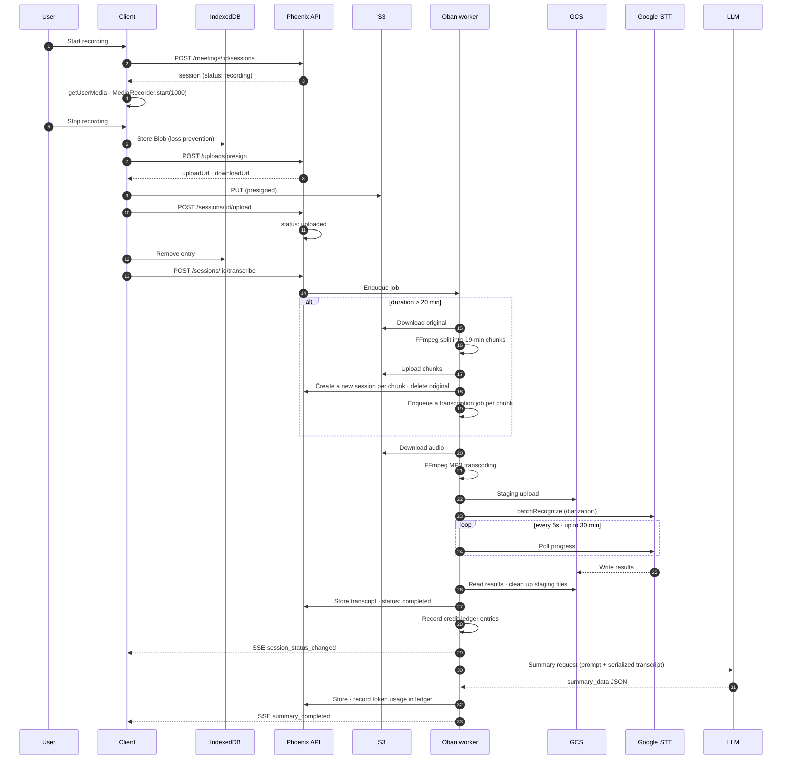

# 04. Recording Pipeline

The full journey of a single recording, from capture to summary.

## End-to-end flow



---

## 1. Recording (client)

| Item | Setting |
|---|---|
| Audio constraints | `channelCount: 1` (mono forced), `echoCancellation: true`, `noiseSuppression: true` |
| MIME fallback | `audio/webm;codecs=opus` → `audio/webm` → `audio/mp4;codecs=aac` → `audio/mp4` → `audio/ogg;codecs=opus` → browser default |
| Chunk collection | `MediaRecorder.start(1000)` — 1-second intervals |
| Waveform | `AudioContext` + `AnalyserNode(fftSize: 256)` → canvas |
| Max length | 3 hours. Remaining time shown as a countdown |
| Device selection | `enumerateDevices()` — labels are empty without permission, so show a hint |
| Permission diagnosis | `navigator.permissions.query({name:"microphone"})` — `unknown` if unsupported |
| Languages | ko-KR / en-US / ja-JP / cmn-Hans-CN / cmn-Hant-TW / es-ES |
| Exit protection | `beforeunload` warning while recording or uploading |
| Lock | Microphone and language cannot be changed while recording |

> **Why mono is forced**: Google STT diarization only supports a single channel.

### Microphone permission — why we split failures finely

`getUserMedia` mostly throws just **one** thing: `NotAllowedError`.
Yet what the user actually needs to do differs completely by situation.
If everything collapses into "microphone access was denied", the user keeps pressing
the same button and leaves. In an app where recording is the entire product, that is fatal.

| Code | When | What the user should do | Does retrying work? |
|---|---|---|---|
| `permission_dismissed` | Dismissed the permission prompt | Press again | ✅ |
| `permission_blocked` | Clicked "Block" and it stuck | Browser site settings | ❌ the prompt never appears |
| `permission_denied` | Denied, but unclear whether it stuck (Safari) | Try once more; if that fails, settings | Ambiguous — so we guide both |
| `system_denied` | The OS privacy settings block the browser | **System** settings | ❌ |
| `embed_blocked` | Missing iframe `allow` / in-app browser policy | Open in a new tab / another browser | ❌ |
| `device_busy` | Another app holds the mic (`NotReadableError`) | End Zoom / the call | ✅ |
| `device_unavailable` | The chosen mic disappeared (`OverconstrainedError`) | Fall back to the default mic | ❌ not as-is |
| `no_device` | No input device at all | Check the connection | ✅ |

Classification happens in two steps.

1. `classifyMediaError` — splits by exception name plus the **message**.
   Chrome reports all five of those situations as `NotAllowedError` and distinguishes them
   only via the message (`Permission denied` / `dismissed` / `denied by system` /
   `permissions policy`).
2. `refinePermissionCode` — reads the Permissions API once more **right after** the denial:
   `denied` upgrades to `permission_blocked`, `prompt` upgrades to `permission_dismissed`.

**When we don't know, we say we don't know.** Safari throws on
`permissions.query({name:"microphone"})` itself. Concluding "blocked" there would lock the
button even for users who would actually get a permission prompt. `unknown` counts toward
"can start".

### Guidance copy comes from one place only

The cause, the steps, and "does retrying work?" are all produced by
`micRecoveryGuide(code, platform)` in `packages/core/src/recorder/permission.ts`.
Screens (desktop, mobile, spike pages) never write their own copy — once they do, the same
situation gets conflicting fixes and nobody knows which one is right.

The steps differ per device (`detectPlatform`).
This is the only place that uses UA sniffing, because **the location of the settings UI**
cannot be determined by feature detection. Getting it wrong here only degrades the
guidance copy; behavior is unaffected.

### Pause policy — needs unification

sisyphus behaved differently on desktop and mobile.

| | sisyphus desktop | sisyphus mobile |
|---|---|---|
| Pause | **End + upload** the current session | `MediaRecorder.pause()` |
| Resume | **Create a new session** | `MediaRecorder.resume()` |
| Result | Sessions get fragmented | One session preserved |

**This app's decision: keep one session via `pause()` / `resume()`.**
- Matches user expectations (pause briefly, then continue)
- Sessions don't fragment, so the speaker scheme stays intact (split sessions have
  independent speaker numbering, which makes stitching hard)
- Elapsed time is computed by subtracting `totalPausedTime`

> The sisyphus desktop resume path called functions that don't exist
> (`getSupportedMimeType`, `startWaveform`) and never actually worked. This must be fixed
> during the port. → [10-porting-map.md](10-porting-map.md)

---

## 2. Upload

### Loss-prevention ordering

```
1. Recording ends → create Blob
2. Store in IndexedDB first          ← survives here even if the network drops
3. Request presign → S3 PUT
4. Register with the server (POST /sessions/:id/upload)
5. Remove from IndexedDB only on success
```

### IndexedDB queue schema

```jsonc
{
  id: "mrss_xxx",          // session ID = key
  blob: Blob,
  mimeType: "audio/webm;codecs=opus",
  durationSeconds: 1234,
  meetingId: "meet_xxx",
  language: "ko-KR",
  startedAtUnix: 1711425600,
  retryCount: 0,
  lastError: null,
  timestamp: 1711425600
}
```

### Retry policy

| Situation | Behavior |
|---|---|
| App start | Check pending entries, retry sequentially (no concurrent uploads) |
| `online` event | Wait for the connection to stabilize, then retry |
| Failure | Increment `retryCount` + record the error |
| `retryCount >= 5` | Stop automatic retries, show a failure banner |
| Failure banner | Offers [Retry all] / [Delete all] |

### S3 presign

sisyphus delegated this issuance to an n8n webhook. **This app implements it directly.**

```
POST /api/uploads/presign
  { meeting_id, session_id, file_name, content_type }
→ { upload_url, download_url, key, expires_in }
```

| Item | Value |
|---|---|
| Signing | AWS Signature V4 query-string presign |
| Method | `PUT`, payload `UNSIGNED-PAYLOAD` |
| Signed headers | `content-disposition;content-type;host` |
| Expiry | 1800 seconds |
| Key path | `data/meetings/{meeting_id}/sessions/{session_id}/{started_at_unix}.{ext}` |
| Download | CDN domain (configured value) |

In Elixir this is handled with `ExAws.S3.presigned_url/5`. We do not hand-roll SigV4.

> Credentials are read **only from the admin DB or environment variables**. No literals in code.
> → [07-config-admin.md](07-config-admin.md)

---

## 3. Transcription

### Split decision

```
duration_seconds > 1200 (20 min)  →  AudioSplitWorker
                              ↓
                     FFmpeg split into 19-min chunks
                     Upload each chunk to S3
                     Create a new RecordingSession per chunk (metadata.part)
                     Soft-delete the original session
                     Enqueue a transcription job per chunk
```

This is required because Google STT `batchRecognize` has an input-length limit.
Chunk sessions show a time range in their label (e.g. `0:00~19:00`).

**Caution**: speaker numbering is independent per chunk. `speaker_1` in chunk 1 and
`speaker_1` in chunk 2 may be different people. The UI must make this explicit.

### STT call

| Item | Value |
|---|---|
| API | Google Cloud Speech-to-Text **v2**, `batchRecognize` |
| Model | Chirp family (configured value) |
| Diarization | Minimum 2 to maximum 10 speakers |
| Input format | Transcoded to MP3 before submission (browser compatibility + STT stability) |
| Input location | GCS staging bucket (`gs://` URI required) |
| Polling | Every 5 seconds, up to 360 times (= 30 min) |
| Cleanup | Delete the GCS staging objects and result files after completion |

### Result post-processing

1. **Group** word-level results **by speaker**
2. **Merge** overly short segments into adjacent ones
3. Store as `segments[]`, and preserve originals in `original_segments[]` (for restore)

### Dev mode

With STT dev mode enabled in settings, the real API is never called and mock segments
are returned. The entire UI flow can be developed and tested without GCP credentials.

---

## 4. Speaker editing

### Two-layer structure

```
transcript.segments[i].speaker  =  "speaker_1"        ← STT original, per segment
speaker_map["speaker_1"]        =  { name, account_id } ← person mapping, per speaker
```

| Operation | UI | What changes | Blast radius |
|---|---|---|---|
| **Speaker chip change** | Click a chip in the top speaker bar | `speaker_map[key]` | **All** utterances by that speaker |
| **Segment change** | Click a message's avatar/name | `segments[i].speaker` | **That one line only** |

The second one is for when STT diarized incorrectly.

### Other edits

| Feature | Description |
|---|---|
| Add speaker | Manually add a speaker STT missed |
| Delete speaker | Remove a wrongly created speaker (its segments move to another speaker) |
| Text editing | Edit a segment's text directly |
| Segment split | Split one segment in two at the cursor (when speakers got mixed) |
| Restore original | Revert using `original_segments` |
| Re-transcribe | Re-run STT for just that session (credits charged again) |

### Speaker colors

A 10-color palette is assigned in order of appearance and stays fixed. Each color is
used at three levels.

| Use | Key |
|---|---|
| Chip background | `pastel` (light pastel) |
| Avatar background | `solid` (medium saturation) |
| Text | `text` (dark, low lightness) |

The palette is ordered for contrast so adjacent colors don't clash. Renaming a speaker
keeps their color.

---

## 5. AI summary

sisyphus delegated this to an n8n workflow. **This app calls the LLM directly.**

### Transcript serialization convention

Before sending to the LLM, each utterance is serialized in the following format.
**This is a convention agreed upon with the prompt.**

```
[<session_id>|<speaker_name>|<HH:MM:SS>] utterance text
```

Example:
```
[mrss_abc|Jane Doe|00:12:34] Then let's go with the voice recording release by April 30.
[mrss_abc|Sam Planner|00:18:05] Let's have Pat Developer own the backend API.
```

### Prompt rules (essential)

- `source.session_id` = the token between `[` and the first `|`
- `source.speaker` = the second token
- `source.time_label` = the third token (`HH:MM:SS` verbatim)
- `source.quote` = the **full utterance** after `]`. The label is not included
- **No abbreviation, translation, or paraphrasing.** If it cannot be read from the label,
  use an empty string. **No fabrication**

### Output schema

```jsonc
summary_data = {
  "one_liner": "1-2 conclusion-focused sentences. What was decided, not a list of agenda items.",
  "decisions": [
    { "text": "one sentence stating a confirmed decision",
      "source": { "session_id": "mrss_abc", "speaker": "Jane Doe",
                  "time_label": "00:12:34", "quote": "the original utterance verbatim" } }
  ],
  "action_items": [
    { "who": "assignee name (\"\" if unassigned)",
      "what": "a one-line task containing an action verb",
      "due": "YYYY-MM-DD or the phrasing as mentioned (\"\" if unspecified)",
      "source": { /* same as above */ } }
  ],
  "facts": ["objective facts stated in the transcript (figures, dates, names, metrics)"],
  "open_questions": ["raised but not resolved in this meeting"],
  "next_steps": ["upcoming schedule/milestones not covered by action_items"],
  "key_topics": ["short noun-phrase tags, 1-3 words. Max 5"],

  // meta (filled in by the server)
  "language": "ko",
  "model": "gemini-2.5-flash",
  "generated_at": "2026-08-19T...",
  "included_session_ids": ["mrss_abc"],
  "skipped_session_ids": []
}
```

Thanks to `source`, **clicking a summary item jumps to that point in the audio**.
This is the product's core UX, so the prompt rules must not be loosened.

### Call parameters

| Item | Value |
|---|---|
| Default model | Gemini (changeable in admin) |
| temperature | 0.2 |
| maxOutputTokens | 16384 |
| Output enforcement | Structured output / JSON schema |
| On failure | Recorded in `last_summary_error`; the existing `summary_data` is kept |

### Modes

| Mode | Trigger | Behavior |
|---|---|---|
| `auto` | Automatic on transcription completion | Stores `summary_data` only |
| `retry` | User clicks [Re-summarize] | Bypasses the auto guard, forces regeneration |

The job is unique per `meeting_id`, so it never runs twice concurrently.

### Usage recording

The token usage from the LLM response is **recorded directly in the credit ledger**.
sisyphus's `service-usage/callback` round trip goes away. → [06-billing.md](06-billing.md)

---

## 6. Playback

| Action | Result |
|---|---|
| Session play button | Plays the session from the beginning |
| Segment click | Plays from that `start_ms` |
| Summary item click | Jumps to the `source.session_id` + `time_label` position |
| Re-clicking the same session | Toggles (hides the player) |

- There is exactly **one** player, pinned to the bottom of the screen
- The current segment is highlighted based on playback position
- A browser bug where a webm file's `duration` reads `Infinity` is corrected
  (force-seek to a known length, then seek back)
